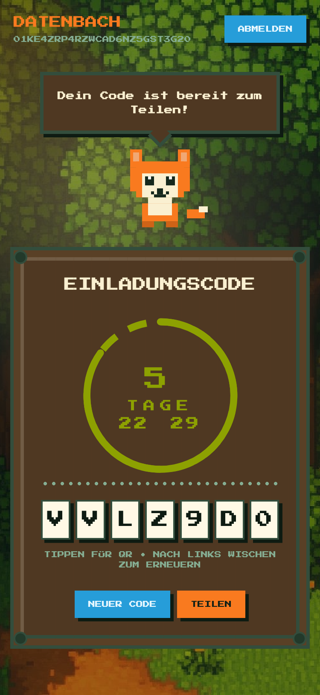

<div align="center">

<h2> Datenbach Social Invites </h2>


[]()
[]()
[]()
[]()
[]()
[]()

Organically grow your Matrix community by sharing registration tokens with your friends and family.


</div>

## 🗺️ map 
- [<code>🗺️ About</code>](#-about)
- [<code>📦 Installation</code>](#-installation)
- [<code>🎮 Development</code>](#-development)
- [<code>🚦️ Environment variables</code>](#-environment-variables)
- [<code>🌐 Deployment</code>](#-deployment)

## 🗺️ About

Datenba.ch runs a communal, invitation only matrix server backed by Matrix Authentication Service (MAS). Traditionally only administrators are allowed to create Registration Tokens for new users which makes organic (Peer-to-Peer) invite creation difficult.

This project is our attempt to bridge the gap between the traditional registration token creation a decentralized (Peer-to-Peer) onboarding approach.

Datenbach Social Invites lets a Matrix user generate and manage a shared registration token for a Matrix homeserver. The React frontend is paired with an Express+Redis backend: after logging in via OIDC, the authenticated Matrix user can issue, view, and revoke a single invite token that other devices sharing the same Matrix identity can reuse.

Currently these tokens are generated with a invalidation timeout of 7 days and will automatically refresh. This allows our users to share their weekly invite code with their friends and family easily.

## 📦 Installation
$${\color{#AC3097}Install \space \color{#56565E}Retro}$$ 

The easiest way to install is to use Docker Compose.
```sh
# copy the environment variables from the .env.example file to a new .env file
cp .env.example .env
#  edit according to your environment variables
# build and run the container
docker compose up
```

Then navigate to `http://localhost:8080` in your browser.


$${\color{#AC3097}Uninstall \space \color{#56565E}Retro}$$
```sh
~/.local/bin/uninstall_retro.sh
```

## 🎮 Development

While package.json contains a local development server configuration, we recommend using Docker Compose for development, since it bundles a local redis server.

```sh
# copy the environment variables from the .env.example file to a new .env.development file
cp .env.example .env.development
#  edit according to your environment variables
# build and run the container
docker compose -f docker-compose.dev.yml up --build
```

## 🚦️ Environment variables

The servers behaviour is controlled by the following environment variables:

```sh
MATRIX_AUTH_SECRET="replace-with-strong-secret"       # signs session cookies
REDIS_HOST="localhost"                               # host for the invite/session cache
REDIS_PORT="6379"
REDIS_USER="your-redis-username"
REDIS_PASS="your-redis-password"
REDIS_TLS="false"
REDIS_TLS_INSECURE="false"
REDIS_URL="redis://localhost:6379"                   # optional override that skips the host/port/user/pass vars
OIDC_CLIENT_ID="your-oidc-client-id"
OIDC_CLIENT_SECRET="your-oidc-client-secret"
OIDC_ISSUER_URL="https://issuer.example.com"
OIDC_REDIRECT_URI="http://localhost:5173/auth/callback"
MATRIX_HOMESERVER_URL="https://matrix.example.com"
MATRIX_ACCESS_TOKEN="your-matrix-token"
MATRIX_USER_ID="@bot:example.com"
```

## 🌐 Deployment

Build the server and run it behind any HTTP proxy. The Docker container is a convenience wrapper:

```sh
docker compose up --build
```


| Variable | Description |
| --- | --- |
| `PORT` | Port that the backend server listens on (default: `3000`). |
| `REDIS_HOST` | Redis host (optional; use with `REDIS_PORT`, `REDIS_USER`, `REDIS_PASS`). |
| `REDIS_PORT` | Redis port (default: `6379`). |
| `REDIS_USER` | Redis username (optional). |
| `REDIS_PASS` | Redis password (optional). |
| `REDIS_TLS` | Set to `true` to enable TLS when using `REDIS_HOST`. |
| `REDIS_TLS_INSECURE` | Set to `true` to skip TLS certificate validation. |
| `REDIS_URL` | Redis connection string for backend caching/state (optional, overrides host/port settings). |
| `MATRIX_AUTH_SECRET` | Secret used to sign the session cookie. |
| `OIDC_ISSUER_URL` | OIDC issuer base URL. |
| `OIDC_CLIENT_ID` | OIDC client ID. |
| `OIDC_CLIENT_SECRET` | OIDC client secret. |
| `OIDC_REDIRECT_URI` | OIDC redirect URI. |
| `MATRIX_HOMESERVER_URL` | Matrix homeserver URL. |
| `MATRIX_ACCESS_TOKEN` | Matrix access token for the bot/user. |
| `MATRIX_USER_ID` | Matrix user ID (e.g. `@bot:example.com`). |
